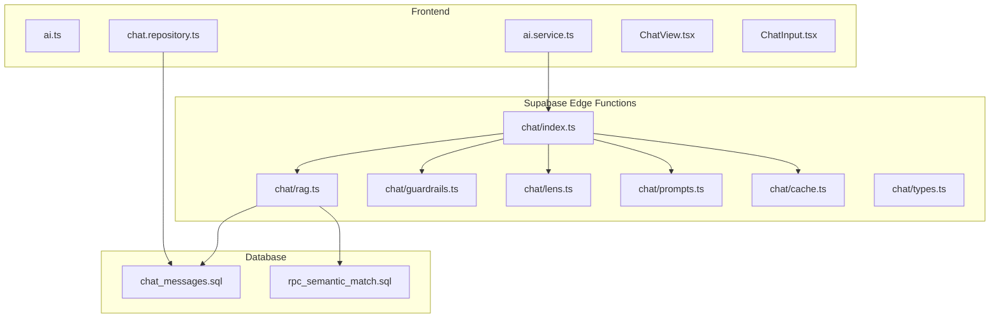
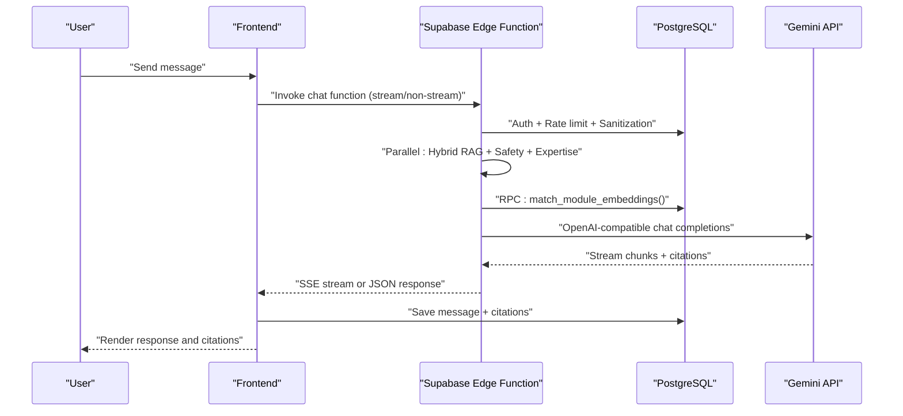
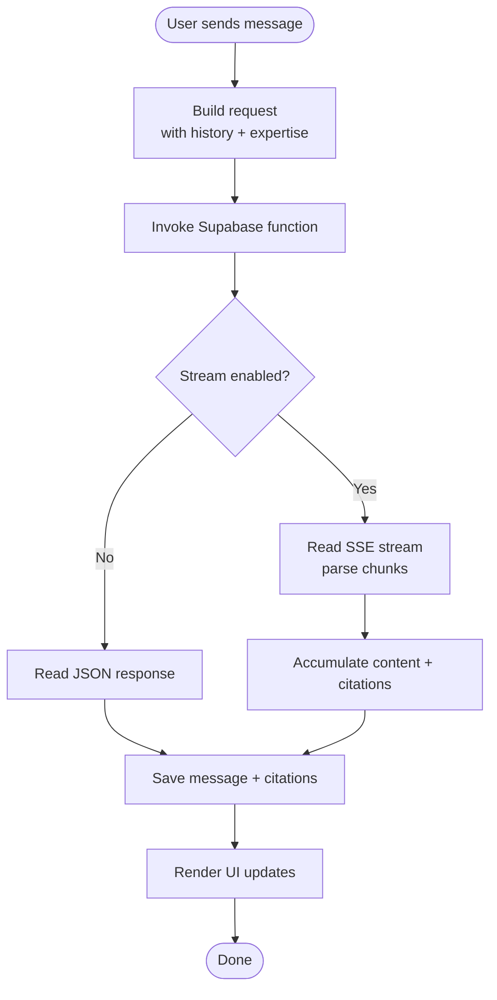
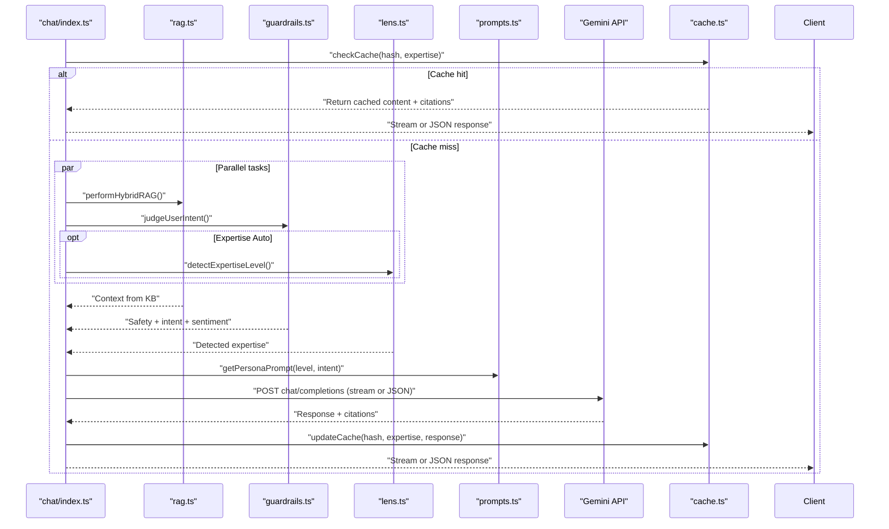
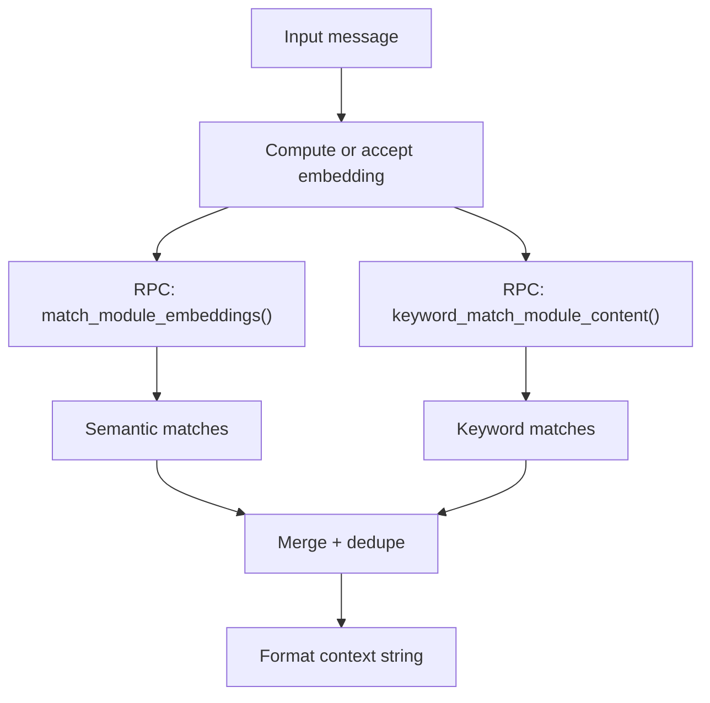
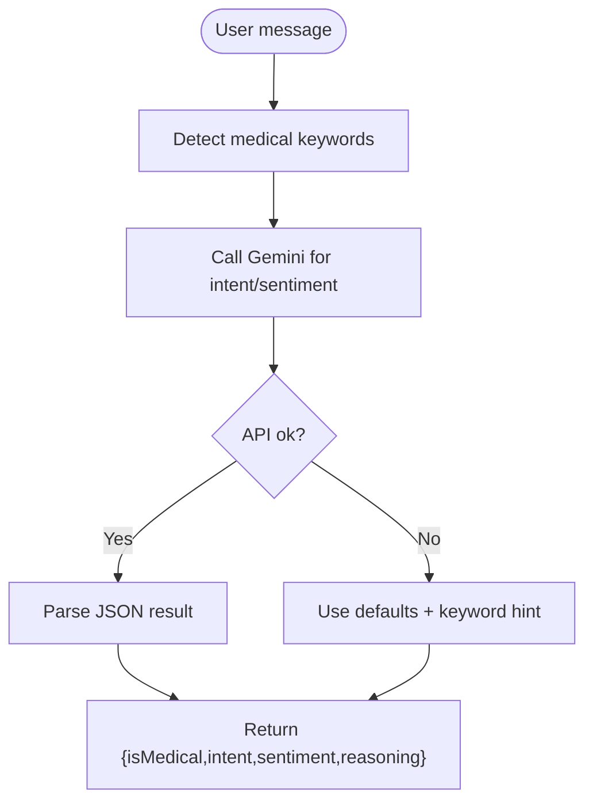
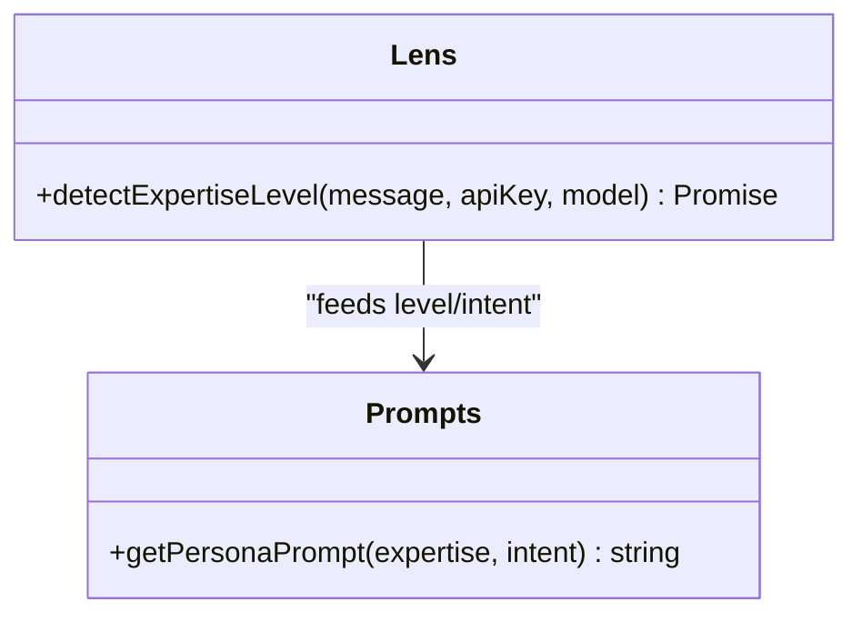
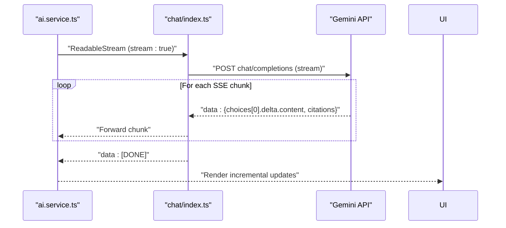
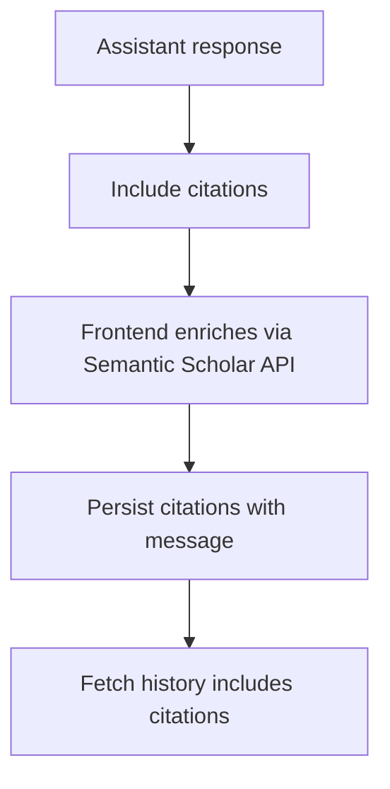
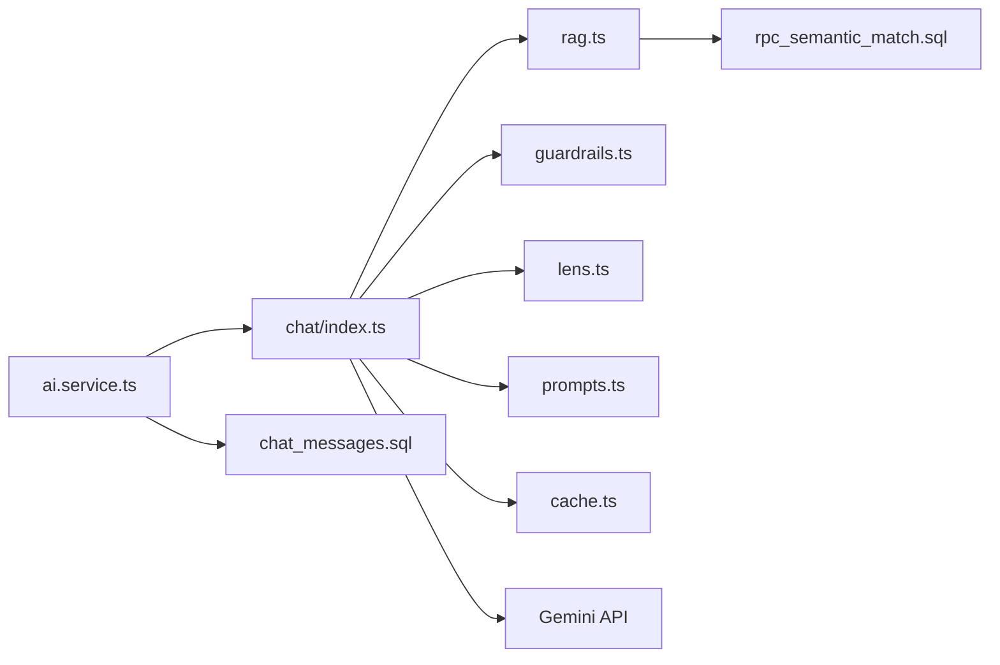

# AI Chat System

<cite>
**Referenced Files in This Document**
- [README.md](file://README.md)
- [ai.ts](file://frontend/src/lib/ai.ts)
- [ai.service.ts](file://frontend/src/lib/services/ai.service.ts)
- [chat.repository.ts](file://frontend/src/lib/repositories/chat.repository.ts)
- [ChatView.tsx](file://frontend/src/components/ChatView.tsx)
- [ChatInput.tsx](file://frontend/src/components/ChatInput.tsx)
- [index.ts](file://supabase/functions/chat/index.ts)
- [rag.ts](file://supabase/functions/chat/rag.ts)
- [guardrails.ts](file://supabase/functions/chat/guardrails.ts)
- [lens.ts](file://supabase/functions/chat/lens.ts)
- [prompts.ts](file://supabase/functions/chat/prompts.ts)
- [cache.ts](file://supabase/functions/chat/cache.ts)
- [types.ts](file://supabase/functions/_shared/types.ts)
- [20260418000100_rpc_semantic_match.sql](file://supabase/migrations/20260418000100_rpc_semantic_match.sql)
- [20260409000001_chat_messages.sql](file://supabase/migrations/20260409000001_chat_messages.sql)
</cite>

## Table of Contents
1. [Introduction](#introduction)
2. [Project Structure](#project-structure)
3. [Core Components](#core-components)
4. [Architecture Overview](#architecture-overview)
5. [Detailed Component Analysis](#detailed-component-analysis)
6. [Dependency Analysis](#dependency-analysis)
7. [Performance Considerations](#performance-considerations)
8. [Troubleshooting Guide](#troubleshooting-guide)
9. [Conclusion](#conclusion)
10. [Appendices](#appendices)

## Introduction
NeuralPeace AI is an expert-level neuroscience assistant featuring adaptive expertise, ethical guardrails, and intelligent citations. The chat system integrates a React frontend with Supabase Edge Functions to deliver a secure, streamed, and RAG-enhanced conversational experience powered by the Gemini API. It supports hybrid retrieval (semantic and keyword), automatic expertise detection, persona-driven responses, and citation generation from Semantic Scholar.

## Project Structure
The system is split into three main areas:
- Frontend (React 19): UI components, chat orchestration, streaming handlers, and Supabase integration.
- Supabase Edge Functions (Deno): Orchestration, RAG, safety checks, persona selection, caching, and streaming.
- Supabase Database: Message history, sessions, embeddings, and vector search functions.

**Diagram sources**
- [ai.service.ts:1-148](file://frontend/src/lib/services/ai.service.ts#L1-L148)
- [chat.repository.ts:1-149](file://frontend/src/lib/repositories/chat.repository.ts#L1-L149)
- [index.ts:1-207](file://supabase/functions/chat/index.ts#L1-L207)
- [rag.ts:1-46](file://supabase/functions/chat/rag.ts#L1-L46)
- [guardrails.ts:1-81](file://supabase/functions/chat/guardrails.ts#L1-L81)
- [lens.ts:1-58](file://supabase/functions/chat/lens.ts#L1-L58)
- [prompts.ts:1-57](file://supabase/functions/chat/prompts.ts#L1-L57)
- [cache.ts:1-47](file://supabase/functions/chat/cache.ts#L1-L47)
- [20260418000100_rpc_semantic_match.sql:1-32](file://supabase/migrations/20260418000100_rpc_semantic_match.sql#L1-L32)
- [20260409000001_chat_messages.sql:1-26](file://supabase/migrations/20260409000001_chat_messages.sql#L1-L26)

**Section sources**
- [README.md:1-86](file://README.md#L1-L86)

## Core Components
- Frontend orchestration and UI:
  - Session ID generation and persistence.
  - Streaming and non-streaming chat invocation.
  - Conversation history retrieval and persistence.
  - Citation metadata enrichment via Semantic Scholar.
- Backend orchestration:
  - Authentication, rate limiting, sanitization, and CORS.
  - Hybrid RAG (semantic and keyword).
  - Safety guardrails and intent classification.
  - Expertise detection and persona selection.
  - Caching and streaming response assembly.
- Database and vector search:
  - Message history and sessions.
  - Semantic match RPC and embedding index.

**Section sources**
- [ai.ts:1-27](file://frontend/src/lib/ai.ts#L1-L27)
- [ai.service.ts:1-148](file://frontend/src/lib/services/ai.service.ts#L1-L148)
- [chat.repository.ts:1-149](file://frontend/src/lib/repositories/chat.repository.ts#L1-L149)
- [index.ts:1-207](file://supabase/functions/chat/index.ts#L1-L207)
- [rag.ts:1-46](file://supabase/functions/chat/rag.ts#L1-L46)
- [guardrails.ts:1-81](file://supabase/functions/chat/guardrails.ts#L1-L81)
- [lens.ts:1-58](file://supabase/functions/chat/lens.ts#L1-L58)
- [prompts.ts:1-57](file://supabase/functions/chat/prompts.ts#L1-L57)
- [cache.ts:1-47](file://supabase/functions/chat/cache.ts#L1-L47)
- [20260418000100_rpc_semantic_match.sql:1-32](file://supabase/migrations/20260418000100_rpc_semantic_match.sql#L1-L32)
- [20260409000001_chat_messages.sql:1-26](file://supabase/migrations/20260409000001_chat_messages.sql#L1-L26)

## Architecture Overview
The chat pipeline integrates frontend and backend components to deliver adaptive, safe, and knowledge-grounded responses.

**Diagram sources**
- [index.ts:31-206](file://supabase/functions/chat/index.ts#L31-L206)
- [rag.ts:3-45](file://supabase/functions/chat/rag.ts#L3-L45)
- [guardrails.ts:24-80](file://supabase/functions/chat/guardrails.ts#L24-L80)
- [lens.ts:7-57](file://supabase/functions/chat/lens.ts#L7-L57)
- [prompts.ts:43-56](file://supabase/functions/chat/prompts.ts#L43-L56)
- [cache.ts:14-46](file://supabase/functions/chat/cache.ts#L14-L46)
- [20260418000100_rpc_semantic_match.sql:2-31](file://supabase/migrations/20260418000100_rpc_semantic_match.sql#L2-L31)
- [ai.service.ts:51-109](file://frontend/src/lib/services/ai.service.ts#L51-L109)

## Detailed Component Analysis

### Frontend: Chat Orchestration and Streaming
- Session management:
  - Unique session ID persisted per browser session.
- Streaming handler:
  - Reads SSE chunks, accumulates content, emits incremental updates, and signals completion.
  - Falls back to mock responses if streaming is unavailable.
- Non-streaming handler:
  - Invokes function and returns aggregated content and citations.
- Conversation persistence:
  - Creates sessions, saves messages, and retrieves history for continuity.

**Diagram sources**
- [ai.service.ts:51-109](file://frontend/src/lib/services/ai.service.ts#L51-L109)
- [chat.repository.ts:86-148](file://frontend/src/lib/repositories/chat.repository.ts#L86-L148)

**Section sources**
- [ai.ts:8-26](file://frontend/src/lib/ai.ts#L8-L26)
- [ai.service.ts:51-137](file://frontend/src/lib/services/ai.service.ts#L51-L137)
- [chat.repository.ts:8-148](file://frontend/src/lib/repositories/chat.repository.ts#L8-L148)
- [ChatView.tsx:15-112](file://frontend/src/components/ChatView.tsx#L15-L112)
- [ChatInput.tsx:10-57](file://frontend/src/components/ChatInput.tsx#L10-L57)

### Backend: Chat Orchestration and Safety
- Authentication and rate limiting:
  - Verifies JWT via Supabase auth; enforces per-user rate limits.
- Input sanitization and CORS:
  - Sanitizes message and conversation history; applies secure CORS headers.
- Hybrid Retrieval Augmented Generation:
  - Computes embeddings (or uses client-provided) and runs semantic and keyword matches.
- Safety and intent classification:
  - Detects medical intent and sentiment; selects persona accordingly.
- Expertise detection:
  - Auto-detects appropriate expertise level when set to “Auto”.
- Persona selection:
  - Chooses persona based on intent or expertise; adds contextual mood instruction.
- Gemini integration:
  - Calls OpenAI-compatible endpoint; streams or returns JSON.
- Caching:
  - Hash-based cache lookup and upsert; TTL enforced.

**Diagram sources**
- [index.ts:31-206](file://supabase/functions/chat/index.ts#L31-L206)
- [rag.ts:3-45](file://supabase/functions/chat/rag.ts#L3-L45)
- [guardrails.ts:24-80](file://supabase/functions/chat/guardrails.ts#L24-L80)
- [lens.ts:7-57](file://supabase/functions/chat/lens.ts#L7-L57)
- [prompts.ts:43-56](file://supabase/functions/chat/prompts.ts#L43-L56)
- [cache.ts:14-46](file://supabase/functions/chat/cache.ts#L14-L46)

**Section sources**
- [index.ts:31-206](file://supabase/functions/chat/index.ts#L31-L206)
- [cache.ts:14-46](file://supabase/functions/chat/cache.ts#L14-L46)

### Hybrid RAG Implementation
- Embedding computation:
  - Uses Supabase AI session with GTE-small if client does not supply embeddings.
- Semantic search:
  - Calls RPC to match embeddings with configurable threshold and count.
- Keyword search:
  - Performs keyword match against module content.
- Merging:
  - Deduplicates and concatenates results with relevance metadata.

**Diagram sources**
- [rag.ts:3-45](file://supabase/functions/chat/rag.ts#L3-L45)
- [20260418000100_rpc_semantic_match.sql:2-31](file://supabase/migrations/20260418000100_rpc_semantic_match.sql#L2-L31)

**Section sources**
- [rag.ts:3-45](file://supabase/functions/chat/rag.ts#L3-L45)
- [20260418000100_rpc_semantic_match.sql:1-32](file://supabase/migrations/20260418000100_rpc_semantic_match.sql#L1-L32)

### Safety Guardrails and Intent Classification
- Medical keyword detection:
  - Heuristic list for high-level triage.
- Intent and sentiment classification:
  - JSON-output Gemini call to categorize intent (research, ethics, art, general) and sentiment (curious, frustrated, skeptical, formal).
- Fallback:
  - Returns defaults on API errors and augments with keyword detection.

**Diagram sources**
- [guardrails.ts:7-10](file://supabase/functions/chat/guardrails.ts#L7-L10)
- [guardrails.ts:24-80](file://supabase/functions/chat/guardrails.ts#L24-L80)

**Section sources**
- [guardrails.ts:1-81](file://supabase/functions/chat/guardrails.ts#L1-L81)

### Expertise Detection and Adaptive Persona
- Expertise detection:
  - Gemini call to classify into Novice, Practitioner, Expert, Scholar.
- Persona selection:
  - Prioritizes intent-specific personas (ResearchBuddy, Ethicist, Artist) when detected; otherwise falls back to expertise-based persona.
- Mood adaptation:
  - Adds contextual instructions for user sentiment (frustrated, skeptical).

**Diagram sources**
- [lens.ts:7-57](file://supabase/functions/chat/lens.ts#L7-L57)
- [prompts.ts:43-56](file://supabase/functions/chat/prompts.ts#L43-L56)

**Section sources**
- [lens.ts:1-58](file://supabase/functions/chat/lens.ts#L1-L58)
- [prompts.ts:1-57](file://supabase/functions/chat/prompts.ts#L1-L57)

### Streaming Handlers and Response Delivery
- Backend streaming:
  - Proxies Gemini SSE stream, parses JSON chunks, forwards deltas, and appends citations.
- Frontend streaming:
  - Parses SSE, yields incremental content and citations, and signals completion.
- Non-streaming fallback:
  - Returns aggregated content and citations; also used when streaming fails.

**Diagram sources**
- [index.ts:162-199](file://supabase/functions/chat/index.ts#L162-L199)
- [ai.service.ts:51-109](file://frontend/src/lib/services/ai.service.ts#L51-L109)

**Section sources**
- [index.ts:162-199](file://supabase/functions/chat/index.ts#L162-L199)
- [ai.service.ts:51-109](file://frontend/src/lib/services/ai.service.ts#L51-L109)

### Citation Generation and Metadata Enrichment
- Backend:
  - Gemini response includes citations; forwarded to client.
- Frontend:
  - Enriches citations with Semantic Scholar metadata (title, authors, year, venue, citation counts).
- Storage:
  - Saves citations alongside messages for retrieval.

**Diagram sources**
- [ai.service.ts:10-46](file://frontend/src/lib/services/ai.service.ts#L10-L46)
- [chat.repository.ts:117-148](file://frontend/src/lib/repositories/chat.repository.ts#L117-L148)

**Section sources**
- [ai.service.ts:10-46](file://frontend/src/lib/services/ai.service.ts#L10-L46)
- [chat.repository.ts:117-148](file://frontend/src/lib/repositories/chat.repository.ts#L117-L148)

## Dependency Analysis
- Frontend depends on Supabase Edge Functions for chat orchestration and on Semantic Scholar for citation metadata.
- Backend depends on Supabase Auth, RLS, RPCs, and Gemini API.
- Database depends on vector search functions and RLS policies.

**Diagram sources**
- [ai.service.ts:1-148](file://frontend/src/lib/services/ai.service.ts#L1-L148)
- [index.ts:1-207](file://supabase/functions/chat/index.ts#L1-L207)
- [rag.ts:1-46](file://supabase/functions/chat/rag.ts#L1-L46)
- [guardrails.ts:1-81](file://supabase/functions/chat/guardrails.ts#L1-L81)
- [lens.ts:1-58](file://supabase/functions/chat/lens.ts#L1-L58)
- [prompts.ts:1-57](file://supabase/functions/chat/prompts.ts#L1-L57)
- [cache.ts:1-47](file://supabase/functions/chat/cache.ts#L1-L47)
- [20260418000100_rpc_semantic_match.sql:1-32](file://supabase/migrations/20260418000100_rpc_semantic_match.sql#L1-L32)
- [20260409000001_chat_messages.sql:1-26](file://supabase/migrations/20260409000001_chat_messages.sql#L1-L26)

**Section sources**
- [types.ts:1-75](file://supabase/functions/_shared/types.ts#L1-L75)

## Performance Considerations
- Parallelization:
  - Hybrid RAG, safety, and optional expertise detection run concurrently to reduce latency.
- Streaming:
  - Enables immediate partial responses and reduces perceived wait time.
- Caching:
  - SHA-256 hashed queries with TTL minimize repeated compute and API calls.
- Vector search:
  - Threshold and count parameters balance recall vs. speed; tune based on domain needs.
- Frontend rendering:
  - Virtualized lists and incremental DOM updates improve scroll performance during streaming.

[No sources needed since this section provides general guidance]

## Troubleshooting Guide
- Authentication failures:
  - Ensure Authorization header is present and valid; verify Supabase auth.getUser succeeds.
- Rate limit exceeded:
  - Respect Retry-After header; consider exponential backoff in client.
- Streaming issues:
  - If SSE is unavailable, client falls back to non-streaming; monitor console warnings and Sentry events.
- Gemini API errors:
  - Non-OK responses are caught and logged; backend returns generic internal error to client.
- Medical intent flagged:
  - Safety classifier may mark as medical; ensure disclaimers are rendered and persona remains educational.
- Citation enrichment:
  - Failures to fetch Semantic Scholar metadata are handled gracefully; UI still renders base citations.

**Section sources**
- [index.ts:40-66](file://supabase/functions/chat/index.ts#L40-L66)
- [index.ts:201-206](file://supabase/functions/chat/index.ts#L201-L206)
- [ai.service.ts:51-109](file://frontend/src/lib/services/ai.service.ts#L51-L109)

## Conclusion
NeuralPeace AI’s chat system combines adaptive expertise, ethical guardrails, and knowledge-grounded responses. The hybrid RAG pipeline, concurrent orchestration, and streaming delivery provide a responsive and accessible neuroscience assistant. Robust caching, citation enrichment, and persona selection tailor the experience across user intents and proficiency levels.

[No sources needed since this section summarizes without analyzing specific files]

## Appendices

### Chat Pipeline: From Input to Delivery
- Preprocessing:
  - Sanitize input, enforce length limits, and build conversation context.
- Semantic matching:
  - Compute embeddings and run semantic + keyword matching via RPCs.
- Safety and persona:
  - Classify intent and sentiment; select persona and mood instruction.
- Response generation:
  - Stream or return JSON from Gemini; accumulate content and citations.
- Post-processing:
  - Update cache; persist messages and citations; enrich citations via Semantic Scholar.

**Section sources**
- [index.ts:78-151](file://supabase/functions/chat/index.ts#L78-L151)
- [rag.ts:12-40](file://supabase/functions/chat/rag.ts#L12-L40)
- [guardrails.ts:24-80](file://supabase/functions/chat/guardrails.ts#L24-L80)
- [prompts.ts:43-56](file://supabase/functions/chat/prompts.ts#L43-L56)
- [cache.ts:34-46](file://supabase/functions/chat/cache.ts#L34-L46)
- [ai.service.ts:10-46](file://frontend/src/lib/services/ai.service.ts#L10-L46)
- [chat.repository.ts:117-148](file://frontend/src/lib/repositories/chat.repository.ts#L117-L148)

### Example Interactions
- Novice-level concept:
  - User asks a foundational question; persona adapts to simple analogies and avoids jargon.
- Practitioner-level clinical application:
  - Persona focuses on mechanisms and diagnostics; citations emphasize established findings.
- Scholar-level theoretical framework:
  - Persona engages with cross-disciplinary paradigms and historical context; citations include primary literature.
- Safety guardrail:
  - If medical keywords are detected, the system emphasizes educational disclaimers and avoids giving advice.

[No sources needed since this section provides conceptual examples]