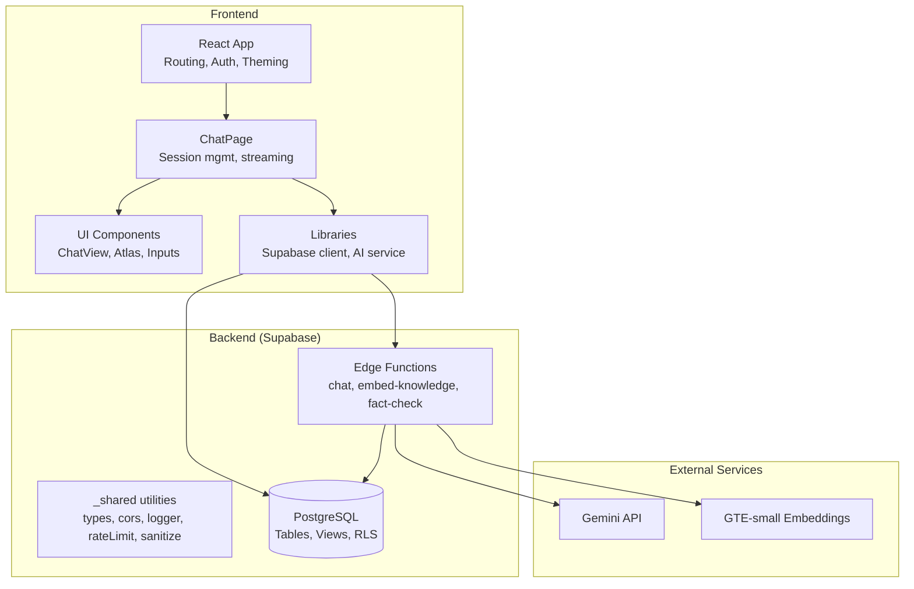
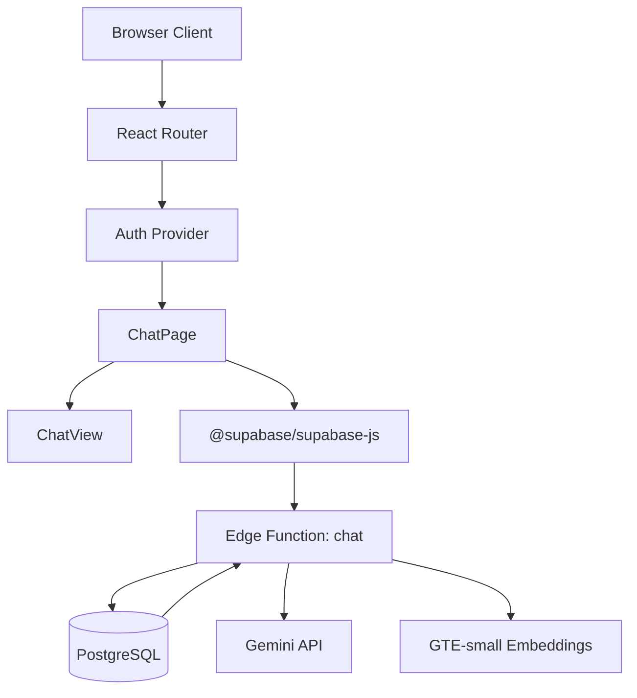
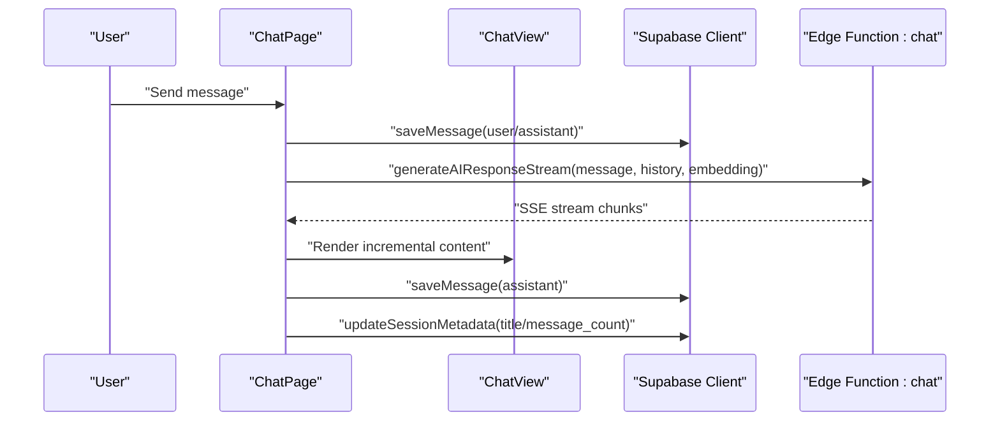
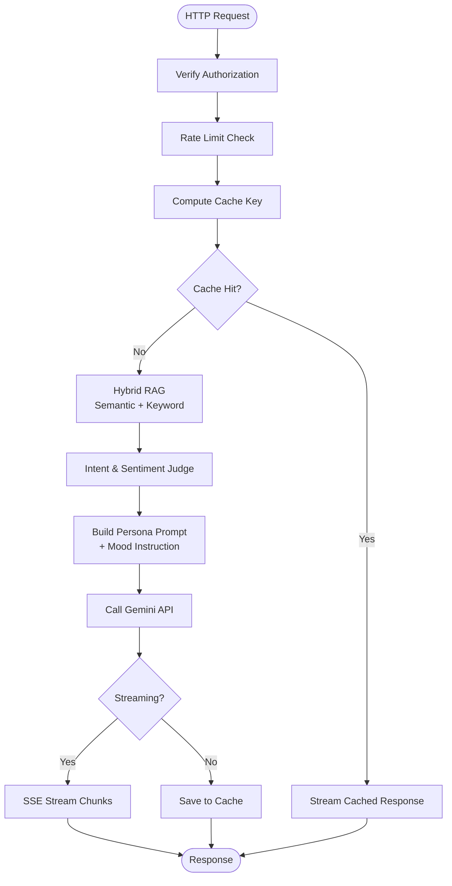
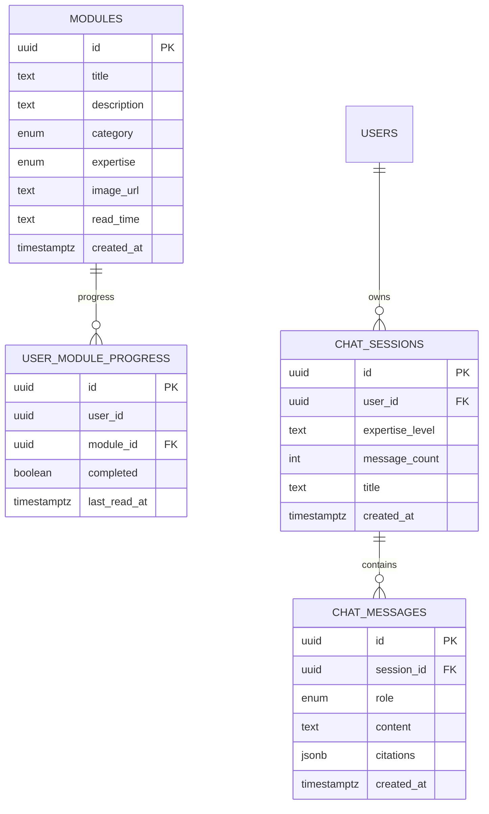
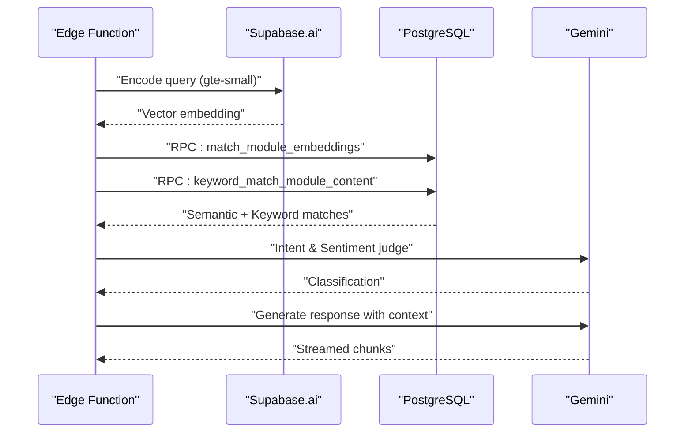
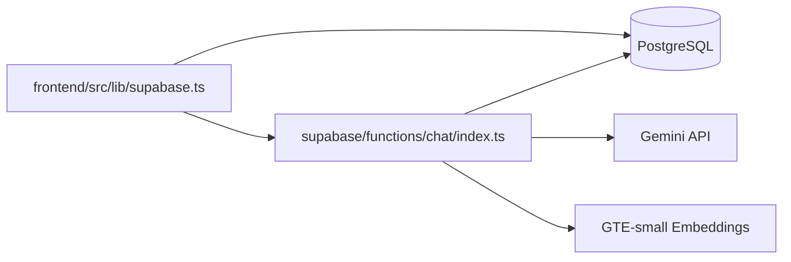

# Architecture Overview

<cite>
**Referenced Files in This Document**
- [README.md](file://README.md)
- [package.json](file://package.json)
- [frontend/package.json](file://frontend/package.json)
- [supabase/config.toml](file://supabase/config.toml)
- [frontend/src/App.tsx](file://frontend/src/App.tsx)
- [frontend/src/pages/ChatPage.tsx](file://frontend/src/pages/ChatPage.tsx)
- [frontend/src/components/ChatView.tsx](file://frontend/src/components/ChatView.tsx)
- [frontend/src/lib/supabase.ts](file://frontend/src/lib/supabase.ts)
- [frontend/src/lib/database.ts](file://frontend/src/lib/database.ts)
- [frontend/src/lib/ai.ts](file://frontend/src/lib/ai.ts)
- [supabase/functions/chat/index.ts](file://supabase/functions/chat/index.ts)
- [supabase/functions/_shared/types.ts](file://supabase/functions/_shared/types.ts)
- [supabase/functions/chat/rag.ts](file://supabase/functions/chat/rag.ts)
- [supabase/functions/chat/guardrails.ts](file://supabase/functions/chat/guardrails.ts)
- [supabase/migrations/20260408034614_initial_schema.sql](file://supabase/migrations/20260408034614_initial_schema.sql)
</cite>

## Table of Contents
1. [Introduction](#introduction)
2. [Project Structure](#project-structure)
3. [Core Components](#core-components)
4. [Architecture Overview](#architecture-overview)
5. [Detailed Component Analysis](#detailed-component-analysis)
6. [Dependency Analysis](#dependency-analysis)
7. [Performance Considerations](#performance-considerations)
8. [Troubleshooting Guide](#troubleshooting-guide)
9. [Conclusion](#conclusion)

## Introduction
NeuralPeace AI is a full-stack neuroscience education platform featuring an adaptive AI assistant, structured knowledge modules, and an interactive 3D brain atlas. The system is built with a modern React frontend, Supabase backend infrastructure, and serverless Edge Functions for AI orchestration. It integrates vector embeddings, hybrid Retrieval-Augmented Generation (RAG), ethical guardrails, and streaming responses powered by Gemini AI.

## Project Structure
The repository is organized into three primary areas:
- frontend: React 19 application with TypeScript, Vite, and Tailwind CSS, implementing routing, authentication, theming, and AI-driven chat experiences.
- supabase: Edge Functions (Deno), PostgreSQL schema and migrations, and shared utilities for CORS, logging, rate limiting, sanitization, and types.
- knowledge_base: Curated Markdown content synchronized into the database for RAG.

**Diagram sources**
- [frontend/src/App.tsx:124-139](file://frontend/src/App.tsx#L124-L139)
- [frontend/src/pages/ChatPage.tsx:30-299](file://frontend/src/pages/ChatPage.tsx#L30-L299)
- [supabase/functions/chat/index.ts:1-207](file://supabase/functions/chat/index.ts#L1-L207)
- [supabase/config.toml:364-376](file://supabase/config.toml#L364-L376)

**Section sources**
- [README.md:64-77](file://README.md#L64-L77)
- [package.json:5-8](file://package.json#L5-L8)
- [frontend/package.json:15-32](file://frontend/package.json#L15-L32)

## Core Components
- Frontend React application
  - Routing with protected routes and lazy-loaded pages.
  - Authentication and theme providers.
  - AI chat pipeline with streaming SSE, session persistence, and citation rendering.
  - Database access for modules and progress.
- Supabase backend
  - Edge Functions for chat orchestration, RAG, guardrails, and embeddings.
  - PostgreSQL schema with typed enums, row-level security, and materialized views.
  - Shared utilities for robust function behavior.
- AI integration
  - Hybrid RAG combining semantic vector search and keyword matching.
  - Ethical guardrails to detect medical intent and sentiment.
  - Streaming responses via Server-Sent Events.

**Section sources**
- [frontend/src/App.tsx:25-41](file://frontend/src/App.tsx#L25-L41)
- [frontend/src/pages/ChatPage.tsx:75-134](file://frontend/src/pages/ChatPage.tsx#L75-L134)
- [supabase/functions/chat/index.ts:31-206](file://supabase/functions/chat/index.ts#L31-L206)
- [supabase/migrations/20260408034614_initial_schema.sql:1-86](file://supabase/migrations/20260408034614_initial_schema.sql#L1-L86)

## Architecture Overview
NeuralPeace AI follows a serverless-first architecture:
- Frontend: SPA served via Vite, communicating with Supabase through a strongly-typed client.
- Backend: Supabase Edge Functions (Deno) handle AI orchestration, caching, rate limiting, and data access.
- Data plane: PostgreSQL stores modules, chat sessions/messages, and user progress with RLS. Vector embeddings power semantic search.
- AI plane: Gemini API for completions and citations; GTE-small embeddings for query encoding.

**Diagram sources**
- [frontend/src/App.tsx:43-122](file://frontend/src/App.tsx#L43-L122)
- [frontend/src/pages/ChatPage.tsx:193-236](file://frontend/src/pages/ChatPage.tsx#L193-L236)
- [frontend/src/lib/supabase.ts:1-14](file://frontend/src/lib/supabase.ts#L1-L14)
- [supabase/functions/chat/index.ts:31-206](file://supabase/functions/chat/index.ts#L31-L206)

## Detailed Component Analysis

### Frontend: Chat Experience and Session Management
The chat page orchestrates session initialization, message streaming, citations, and intelligent atlas triggers. It persists sessions in the database and manages conversation history and metadata updates.

**Diagram sources**
- [frontend/src/pages/ChatPage.tsx:149-236](file://frontend/src/pages/ChatPage.tsx#L149-L236)
- [frontend/src/components/ChatView.tsx:15-112](file://frontend/src/components/ChatView.tsx#L15-L112)
- [supabase/functions/chat/index.ts:146-199](file://supabase/functions/chat/index.ts#L146-L199)

**Section sources**
- [frontend/src/pages/ChatPage.tsx:75-134](file://frontend/src/pages/ChatPage.tsx#L75-L134)
- [frontend/src/pages/ChatPage.tsx:193-236](file://frontend/src/pages/ChatPage.tsx#L193-L236)
- [frontend/src/components/ChatView.tsx:15-112](file://frontend/src/components/ChatView.tsx#L15-L112)

### Backend: Edge Function Orchestration (chat)
The chat Edge Function performs authentication, rate limiting, caching, hybrid RAG, intent/safety checks, and streams responses from Gemini. It uses shared utilities for CORS, logging, and sanitization.

**Diagram sources**
- [supabase/functions/chat/index.ts:31-206](file://supabase/functions/chat/index.ts#L31-L206)
- [supabase/functions/chat/rag.ts:1-46](file://supabase/functions/chat/rag.ts#L1-L46)
- [supabase/functions/chat/guardrails.ts:1-81](file://supabase/functions/chat/guardrails.ts#L1-L81)
- [supabase/functions/_shared/types.ts:1-75](file://supabase/functions/_shared/types.ts#L1-L75)

**Section sources**
- [supabase/functions/chat/index.ts:31-206](file://supabase/functions/chat/index.ts#L31-L206)
- [supabase/functions/chat/rag.ts:1-46](file://supabase/functions/chat/rag.ts#L1-L46)
- [supabase/functions/chat/guardrails.ts:1-81](file://supabase/functions/chat/guardrails.ts#L1-L81)

### Data Layer: Schema, Views, and Access Patterns
The schema defines typed categories and expertise levels, enforces read-only access for modules, and supports row-level security. Views and RPCs facilitate efficient lookups and semantic matching.

**Diagram sources**
- [supabase/migrations/20260408034614_initial_schema.sql:1-86](file://supabase/migrations/20260408034614_initial_schema.sql#L1-L86)

**Section sources**
- [supabase/migrations/20260408034614_initial_schema.sql:1-86](file://supabase/migrations/20260408034614_initial_schema.sql#L1-L86)
- [frontend/src/lib/database.ts:7-106](file://frontend/src/lib/database.ts#L7-L106)

### AI Integration: Hybrid RAG and Guardrails
Hybrid RAG combines vector similarity and keyword matching to retrieve relevant knowledge. Intent and sentiment classification steers persona selection and ethical framing.

**Diagram sources**
- [supabase/functions/chat/rag.ts:1-46](file://supabase/functions/chat/rag.ts#L1-L46)
- [supabase/functions/chat/guardrails.ts:1-81](file://supabase/functions/chat/guardrails.ts#L1-L81)
- [supabase/functions/chat/index.ts:106-151](file://supabase/functions/chat/index.ts#L106-L151)

**Section sources**
- [supabase/functions/chat/rag.ts:1-46](file://supabase/functions/chat/rag.ts#L1-L46)
- [supabase/functions/chat/guardrails.ts:1-81](file://supabase/functions/chat/guardrails.ts#L1-L81)

## Dependency Analysis
- Frontend depends on Supabase client for database and auth operations and Edge Functions for AI orchestration.
- Edge Functions depend on Supabase client, shared utilities, and external APIs (Gemini, embeddings).
- Database schema defines relationships and RLS policies that govern access patterns.

**Diagram sources**
- [frontend/src/lib/supabase.ts:1-14](file://frontend/src/lib/supabase.ts#L1-L14)
- [supabase/functions/chat/index.ts:1-23](file://supabase/functions/chat/index.ts#L1-L23)

**Section sources**
- [frontend/src/lib/supabase.ts:1-14](file://frontend/src/lib/supabase.ts#L1-L14)
- [supabase/functions/chat/index.ts:1-23](file://supabase/functions/chat/index.ts#L1-L23)

## Performance Considerations
- Streaming responses reduce perceived latency and improve interactivity.
- Hybrid RAG balances accuracy and speed by combining vector and keyword retrieval.
- Caching avoids redundant AI calls for repeated queries.
- Rate limiting protects backend resources and ensures fair usage.
- Client-side virtualization efficiently renders long conversation histories.

## Troubleshooting Guide
Common issues and resolutions:
- Authentication failures: Ensure Authorization header is present and valid; verify Supabase credentials and service role keys.
- Rate limit errors: Respect Retry-After headers and implement exponential backoff on the client.
- CORS errors: Confirm allowed origins and credentials handling in Edge Function CORS headers.
- Message length violations: Enforce client-side sanitization and adhere to configured limits.
- Database access denied: Verify RLS policies and user ownership for protected tables.

**Section sources**
- [supabase/functions/chat/index.ts:40-66](file://supabase/functions/chat/index.ts#L40-L66)
- [supabase/functions/_shared/types.ts:1-75](file://supabase/functions/_shared/types.ts#L1-L75)

## Conclusion
NeuralPeace AI leverages a clean separation of concerns: the frontend focuses on UX and presentation, while Supabase Edge Functions encapsulate AI orchestration, data access, and security. The hybrid RAG, guardrails, and streaming architecture deliver an adaptive, ethical, and responsive neuroscience education experience. The typed schema and RLS provide strong data governance, while serverless deployment simplifies scaling and maintenance.