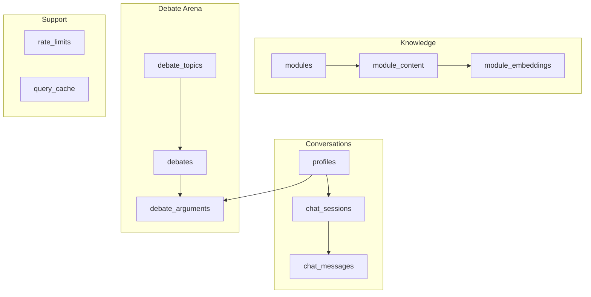
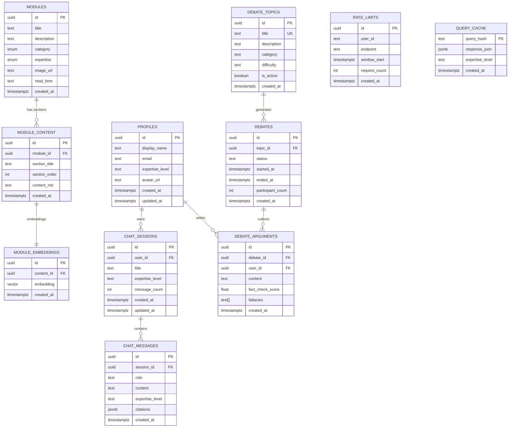
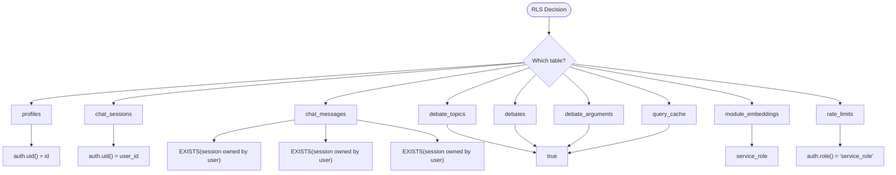
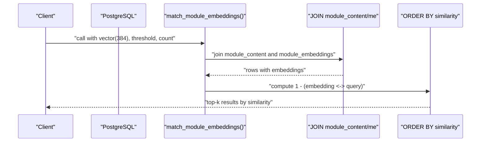
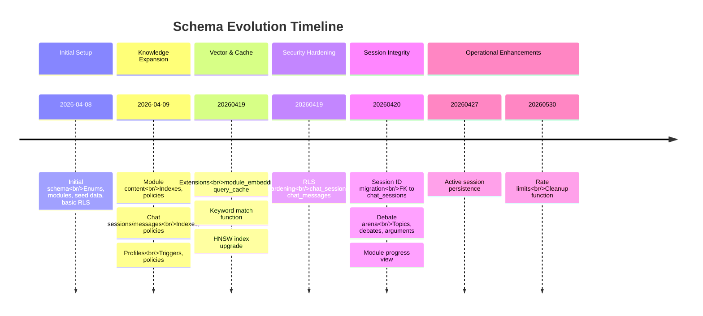
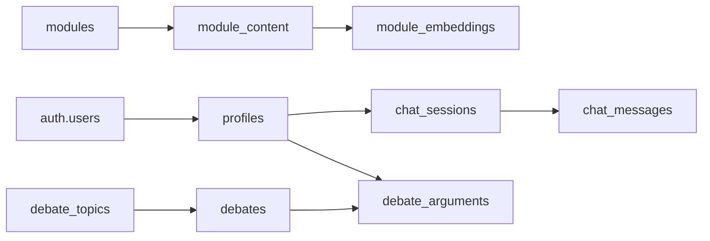
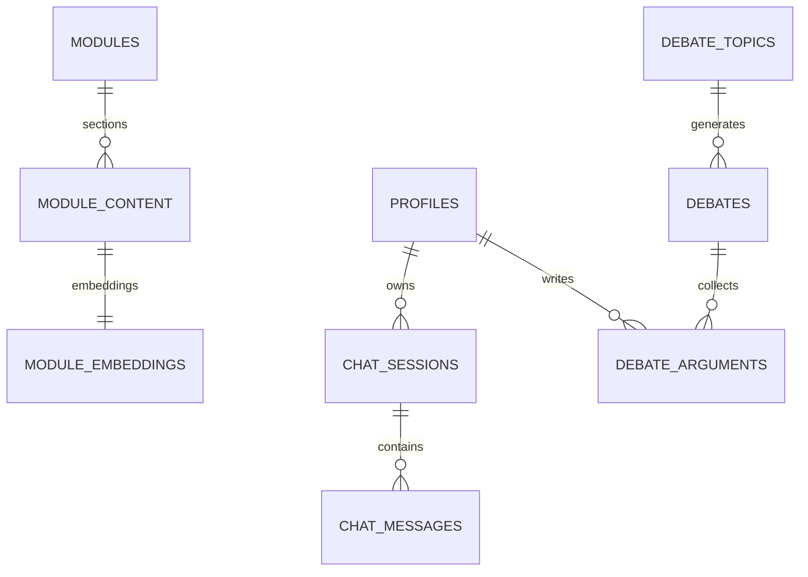

# Database Design & Schema

<cite>
**Referenced Files in This Document**
- [20260408034614_initial_schema.sql](file://supabase/migrations/20260408034614_initial_schema.sql)
- [20260409000000_module_content.sql](file://supabase/migrations/20260409000000_module_content.sql)
- [20260409000001_chat_messages.sql](file://supabase/migrations/20260409000001_chat_messages.sql)
- [20260409000002_profiles.sql](file://supabase/migrations/20260409000002_profiles.sql)
- [20260409000003_chat_sessions.sql](file://supabase/migrations/20260409000003_chat_sessions.sql)
- [20260418000100_rpc_semantic_match.sql](file://supabase/migrations/20260418000100_rpc_semantic_match.sql)
- [20260419000000_fix_missing_objects.sql](file://supabase/migrations/20260419000000_fix_missing_objects.sql)
- [20260419000001_secure_rls.sql](file://supabase/migrations/20260419000001_secure_rls.sql)
- [20260419010000_upgrade_vector_index.sql](file://supabase/migrations/20260419010000_upgrade_vector_index.sql)
- [20260420000000_migrate_session_id_to_uuid.sql](file://supabase/migrations/20260420000000_migrate_session_id_to_uuid.sql)
- [20260420000000_mind_meld_arena.sql](file://supabase/migrations/20260420000000_mind_meld_arena.sql)
- [20260421000000_module_progress_view.sql](file://supabase/migrations/20260421000000_module_progress_view.sql)
- [20260427000000_active_session_persistence.sql](file://supabase/migrations/20260427000000_active_session_persistence.sql)
- [20260530000000_rate_limits.sql](file://supabase/migrations/20260530000000_rate_limits.sql)
</cite>

## Table of Contents
1. [Introduction](#introduction)
2. [Project Structure](#project-structure)
3. [Core Components](#core-components)
4. [Architecture Overview](#architecture-overview)
5. [Detailed Component Analysis](#detailed-component-analysis)
6. [Dependency Analysis](#dependency-analysis)
7. [Performance Considerations](#performance-considerations)
8. [Troubleshooting Guide](#troubleshooting-guide)
9. [Conclusion](#conclusion)
10. [Appendices](#appendices)

## Introduction
This document describes the PostgreSQL schema powering NeuralPeace AI’s knowledge modules, chat, debate arena, and supporting infrastructure. It covers core tables, relationships, constraints, row-level security (RLS), vector search, indexing strategies, schema evolution via migrations, data integrity mechanisms, and operational considerations such as security, backups, and scaling. It also includes entity relationship diagrams, table schemas, and practical query patterns.

## Project Structure
The database schema is defined and evolved through a series of SQL migration files under the Supabase configuration. The migrations establish:
- Core domain entities: modules, module content, module embeddings, and user profiles
- Conversational context: chat sessions and messages
- Debate arena: topics, debates, and arguments
- Auxiliary tables: rate limits, query cache
- Views: module progress view
- Security: RLS policies and service roles
- Vector search: embeddings with HNSW index and semantic matching RPC

**Diagram sources**
- [20260408034614_initial_schema.sql:16-25](file://supabase/migrations/20260408034614_initial_schema.sql#L16-L25)
- [20260409000000_module_content.sql:2-9](file://supabase/migrations/20260409000000_module_content.sql#L2-L9)
- [20260419000000_fix_missing_objects.sql:6-13](file://supabase/migrations/20260419000000_fix_missing_objects.sql#L6-L13)
- [20260409000002_profiles.sql:2-10](file://supabase/migrations/20260409000002_profiles.sql#L2-L10)
- [20260409000003_chat_sessions.sql:2-10](file://supabase/migrations/20260409000003_chat_sessions.sql#L2-L10)
- [20260409000001_chat_messages.sql:2-10](file://supabase/migrations/20260409000001_chat_messages.sql#L2-L10)
- [20260420000000_mind_meld_arena.sql:5-35](file://supabase/migrations/20260420000000_mind_meld_arena.sql#L5-L35)
- [20260530000000_rate_limits.sql:2-10](file://supabase/migrations/20260530000000_rate_limits.sql#L2-L10)

**Section sources**
- [20260408034614_initial_schema.sql:1-86](file://supabase/migrations/20260408034614_initial_schema.sql#L1-L86)
- [20260409000000_module_content.sql:1-268](file://supabase/migrations/20260409000000_module_content.sql#L1-L268)
- [20260409000001_chat_messages.sql:1-26](file://supabase/migrations/20260409000001_chat_messages.sql#L1-L26)
- [20260409000002_profiles.sql:1-60](file://supabase/migrations/20260409000002_profiles.sql#L1-L60)
- [20260409000003_chat_sessions.sql:1-42](file://supabase/migrations/20260409000003_chat_sessions.sql#L1-L42)
- [20260418000100_rpc_semantic_match.sql:1-32](file://supabase/migrations/20260418000100_rpc_semantic_match.sql#L1-L32)
- [20260419000000_fix_missing_objects.sql:1-79](file://supabase/migrations/20260419000000_fix_missing_objects.sql#L1-L79)
- [20260419000001_secure_rls.sql:1-58](file://supabase/migrations/20260419000001_secure_rls.sql#L1-L58)
- [20260419010000_upgrade_vector_index.sql:1-9](file://supabase/migrations/20260419010000_upgrade_vector_index.sql#L1-L9)
- [20260420000000_migrate_session_id_to_uuid.sql:1-66](file://supabase/migrations/20260420000000_migrate_session_id_to_uuid.sql#L1-L66)
- [20260420000000_mind_meld_arena.sql:1-64](file://supabase/migrations/20260420000000_mind_meld_arena.sql#L1-L64)
- [20260421000000_module_progress_view.sql:1-23](file://supabase/migrations/20260421000000_module_progress_view.sql#L1-L23)
- [20260427000000_active_session_persistence.sql:1-4](file://supabase/migrations/20260427000000_active_session_persistence.sql#L1-L4)
- [20260530000000_rate_limits.sql:1-31](file://supabase/migrations/20260530000000_rate_limits.sql#L1-L31)

## Core Components
This section documents the primary tables, enums, and their relationships.

- Enumerations
  - category: Neuroanatomy, Methods, Computational, Psychology, Therapeutics
  - expertise_level: Novice, Practitioner, Expert, Scholar

- Modules
  - Purpose: Stores curated knowledge modules with metadata.
  - Key fields: id (UUID), title, description, category, expertise, image_url, read_time, created_at.
  - Constraints: Primary key on id; created_at defaults to UTC timestamp.
  - RLS: Public read-only access enabled.

- Module Content
  - Purpose: Stores markdown sections per module with ordering.
  - Key fields: id (UUID), module_id (UUID), section_title, section_order, content_md, created_at.
  - Constraints: Primary key on id; foreign key to modules; indexes on module_id and (module_id, section_order); created_at defaults to UTC timestamp.
  - RLS: Public read-only access enabled.

- Module Embeddings
  - Purpose: Vector embeddings for semantic search over module content.
  - Key fields: id (UUID), content_id (UUID), embedding (vector 384), created_at.
  - Constraints: Unique constraint on content_id; foreign key to module_content; created_at defaults to UTC timestamp.
  - Indexes: HNSW vector index on embedding using cosine similarity.
  - RLS: Service role access for management; public read-only for caches.

- Chat Sessions
  - Purpose: Groups related chat conversations per user.
  - Key fields: id (UUID), user_id (UUID), title, expertise_level, message_count, created_at, updated_at.
  - Constraints: Primary key on id; foreign key to auth.users; indexes on user_id and updated_at; timestamps default to UTC.
  - RLS: Users can manage their own sessions.

- Chat Messages
  - Purpose: Stores individual messages within a session.
  - Key fields: id (UUID), session_id (UUID), role, content, expertise_level, citations (JSONB), created_at.
  - Constraints: Primary key on id; foreign key to chat_sessions; role check constraint; indexes on session_id and created_at; created_at defaults to UTC.
  - RLS: Users can view/select messages from their sessions; insert/update checks enforce ownership.

- Profiles
  - Purpose: User profile linked to Supabase auth.users.
  - Key fields: id (UUID), display_name, email, expertise_level, avatar_url, created_at, updated_at.
  - Constraints: Primary key on id; foreign key to auth.users; unique id; indexes on email; timestamps default to UTC.
  - RLS: Users can read/update their own profile; insert on signup handled by trigger.
  - Triggers: Auto-create profile on user creation; auto-update updated_at on updates.

- Debate Topics
  - Purpose: Curated debate subjects.
  - Key fields: id (UUID), title (unique), description, category, difficulty, is_active, created_at.
  - Constraints: Primary key on id; unique title; created_at defaults to UTC.

- Debates
  - Purpose: Active debate instances tied to topics.
  - Key fields: id (UUID), topic_id (UUID), status, started_at, ended_at, participant_count, created_at.
  - Constraints: Primary key on id; foreign key to debate_topics; status constrained; created_at defaults to UTC.

- Debate Arguments
  - Purpose: User contributions to debates.
  - Key fields: id (UUID), debate_id (UUID), user_id (UUID), content, fact_check_score, fallacies (array), created_at.
  - Constraints: Primary key on id; foreign keys to debates and auth.users; created_at defaults to UTC.

- Rate Limits
  - Purpose: Endpoint rate limiting with time-windowed counters.
  - Key fields: id (UUID), user_id, endpoint, window_start, request_count, created_at.
  - Constraints: Primary key on id; unique composite on (user_id, endpoint, window_start); created_at defaults to UTC.
  - RLS: Only service_role can manage; cleanup job deletes old entries.

- Query Cache
  - Purpose: Caches AI responses keyed by hash.
  - Key fields: query_hash (TEXT), response_json (JSONB), expertise_level, created_at.
  - Constraints: Primary key on query_hash; created_at defaults to UTC.
  - RLS: Public read-only; service_role manages writes.

- Module Progress View
  - Purpose: Denormalized view of module completion per user.
  - Fields: module metadata plus user_id, completed, last_read_at.
  - RLS: Enforced via security_invoker on the view.

**Section sources**
- [20260408034614_initial_schema.sql:1-86](file://supabase/migrations/20260408034614_initial_schema.sql#L1-L86)
- [20260409000000_module_content.sql:1-268](file://supabase/migrations/20260409000000_module_content.sql#L1-L268)
- [20260409000001_chat_messages.sql:1-26](file://supabase/migrations/20260409000001_chat_messages.sql#L1-L26)
- [20260409000002_profiles.sql:1-60](file://supabase/migrations/20260409000002_profiles.sql#L1-L60)
- [20260409000003_chat_sessions.sql:1-42](file://supabase/migrations/20260409000003_chat_sessions.sql#L1-L42)
- [20260419000000_fix_missing_objects.sql:1-79](file://supabase/migrations/20260419000000_fix_missing_objects.sql#L1-L79)
- [20260420000000_mind_meld_arena.sql:1-64](file://supabase/migrations/20260420000000_mind_meld_arena.sql#L1-L64)
- [20260421000000_module_progress_view.sql:1-23](file://supabase/migrations/20260421000000_module_progress_view.sql#L1-L23)
- [20260530000000_rate_limits.sql:1-31](file://supabase/migrations/20260530000000_rate_limits.sql#L1-L31)

## Architecture Overview
The schema supports three primary domains:
- Knowledge modules with embedded semantic search
- Private conversational context per user
- Public debate topics with authenticated participation

**Diagram sources**
- [20260408034614_initial_schema.sql:16-25](file://supabase/migrations/20260408034614_initial_schema.sql#L16-L25)
- [20260409000000_module_content.sql:2-9](file://supabase/migrations/20260409000000_module_content.sql#L2-L9)
- [20260419000000_fix_missing_objects.sql:6-13](file://supabase/migrations/20260419000000_fix_missing_objects.sql#L6-L13)
- [20260409000002_profiles.sql:2-10](file://supabase/migrations/20260409000002_profiles.sql#L2-L10)
- [20260409000003_chat_sessions.sql:2-10](file://supabase/migrations/20260409000003_chat_sessions.sql#L2-L10)
- [20260409000001_chat_messages.sql:2-10](file://supabase/migrations/20260409000001_chat_messages.sql#L2-L10)
- [20260420000000_mind_meld_arena.sql:5-35](file://supabase/migrations/20260420000000_mind_meld_arena.sql#L5-L35)
- [20260530000000_rate_limits.sql:2-10](file://supabase/migrations/20260530000000_rate_limits.sql#L2-L10)

## Detailed Component Analysis

### Row-Level Security (RLS)
- modules: Public read access; restRICTED for mutations.
- module_content: Public read access; restRICTED for mutations.
- profiles: Users can read/update their own profile; insert handled by trigger on auth.users.
- chat_sessions: Users can manage their own sessions (ALL actions).
- chat_messages: Select requires session ownership; insert/update require session ownership.
- debate_topics: Public read access.
- debates: Public read access; insert requires authenticated role.
- debate_arguments: Public read access; insert requires authenticated user matches argument user_id.
- module_embeddings: Service role can manage; public read-only for caches.
- query_cache: Public read-only; service role can manage.
- rate_limits: Only service_role can manage; auto-cleanup function removes stale rows.

**Diagram sources**
- [20260419000001_secure_rls.sql:8-57](file://supabase/migrations/20260419000001_secure_rls.sql#L8-L57)
- [20260420000000_migrate_session_id_to_uuid.sql:27-65](file://supabase/migrations/20260420000000_migrate_session_id_to_uuid.sql#L27-L65)
- [20260420000000_mind_meld_arena.sql:45-57](file://supabase/migrations/20260420000000_mind_meld_arena.sql#L45-L57)
- [20260419000000_fix_missing_objects.sql:63-78](file://supabase/migrations/20260419000000_fix_missing_objects.sql#L63-L78)
- [20260530000000_rate_limits.sql:18-21](file://supabase/migrations/20260530000000_rate_limits.sql#L18-L21)

**Section sources**
- [20260419000001_secure_rls.sql:1-58](file://supabase/migrations/20260419000001_secure_rls.sql#L1-L58)
- [20260420000000_migrate_session_id_to_uuid.sql:1-66](file://supabase/migrations/20260420000000_migrate_session_id_to_uuid.sql#L1-L66)
- [20260420000000_mind_meld_arena.sql:45-57](file://supabase/migrations/20260420000000_mind_meld_arena.sql#L45-L57)
- [20260419000000_fix_missing_objects.sql:59-78](file://supabase/migrations/20260419000000_fix_missing_objects.sql#L59-L78)
- [20260530000000_rate_limits.sql:15-31](file://supabase/migrations/20260530000000_rate_limits.sql#L15-L31)

### Vector Search and Semantic Matching
- Embeddings: Stored in module_embeddings with vector dimension 384.
- Index: HNSW with cosine operations for efficient similarity search.
- Function: match_module_embeddings(query_embedding, match_threshold, match_count) returns matching module_content rows with similarity scores.

**Diagram sources**
- [20260418000100_rpc_semantic_match.sql:2-31](file://supabase/migrations/20260418000100_rpc_semantic_match.sql#L2-L31)
- [20260419000000_fix_missing_objects.sql:15-15](file://supabase/migrations/20260419000000_fix_missing_objects.sql#L15-L15)
- [20260419010000_upgrade_vector_index.sql:6-8](file://supabase/migrations/20260419010000_upgrade_vector_index.sql#L6-L8)

**Section sources**
- [20260419000000_fix_missing_objects.sql:1-79](file://supabase/migrations/20260419000000_fix_missing_objects.sql#L1-L79)
- [20260418000100_rpc_semantic_match.sql:1-32](file://supabase/migrations/20260418000100_rpc_semantic_match.sql#L1-L32)
- [20260419010000_upgrade_vector_index.sql:1-9](file://supabase/migrations/20260419010000_upgrade_vector_index.sql#L1-L9)

### Indexing Strategies
- module_content: Index on module_id; composite index on (module_id, section_order).
- chat_messages: Index on (session_id, created_at); index on created_at.
- chat_sessions: Index on (user_id, updated_at DESC); index on updated_at DESC.
- module_embeddings: HNSW index on embedding using vector_cosine_ops.
- query_cache: Index on query_hash.
- rate_limits: Composite index on (user_id, endpoint, window_start DESC).

**Section sources**
- [20260409000000_module_content.sql:11-12](file://supabase/migrations/20260409000000_module_content.sql#L11-L12)
- [20260409000001_chat_messages.sql:12-13](file://supabase/migrations/20260409000001_chat_messages.sql#L12-L13)
- [20260409000003_chat_sessions.sql:12-13](file://supabase/migrations/20260409000003_chat_sessions.sql#L12-L13)
- [20260419010000_upgrade_vector_index.sql:4-8](file://supabase/migrations/20260419010000_upgrade_vector_index.sql#L4-L8)
- [20260419000000_fix_missing_objects.sql:25-25](file://supabase/migrations/20260419000000_fix_missing_objects.sql#L25-L25)
- [20260530000000_rate_limits.sql:12-13](file://supabase/migrations/20260530000000_rate_limits.sql#L12-L13)

### Schema Evolution Through Migrations
- Initial schema: Defines enums, modules, seeds, and baseline RLS.
- Module content: Adds module_content with indexes and policies.
- Chat entities: Introduces chat_messages and chat_sessions with indexes and policies.
- Profiles: Adds profiles with triggers for auto-create and update timestamps.
- Vector and cache: Enables vector extension, creates module_embeddings and query_cache, adds keyword match function.
- RLS hardening: Restricts chat_sessions and chat_messages to owners.
- Session ID migration: Changes chat_messages.session_id to UUID and adds FK to chat_sessions.
- Debate arena: Adds debate_topics, debates, debate_arguments; extends profiles; enables realtime publication.
- Module progress view: Creates module_progress_view with security_invoker.
- Active session persistence: Adds active_session_id to profiles.
- Rate limits: Adds rate_limits with cleanup function and policy.

**Diagram sources**
- [20260408034614_initial_schema.sql:1-86](file://supabase/migrations/20260408034614_initial_schema.sql#L1-L86)
- [20260409000000_module_content.sql:1-268](file://supabase/migrations/20260409000000_module_content.sql#L1-L268)
- [20260409000001_chat_messages.sql:1-26](file://supabase/migrations/20260409000001_chat_messages.sql#L1-L26)
- [20260409000002_profiles.sql:1-60](file://supabase/migrations/20260409000002_profiles.sql#L1-L60)
- [20260419000000_fix_missing_objects.sql:1-79](file://supabase/migrations/20260419000000_fix_missing_objects.sql#L1-L79)
- [20260419000001_secure_rls.sql:1-58](file://supabase/migrations/20260419000001_secure_rls.sql#L1-L58)
- [20260420000000_migrate_session_id_to_uuid.sql:1-66](file://supabase/migrations/20260420000000_migrate_session_id_to_uuid.sql#L1-L66)
- [20260420000000_mind_meld_arena.sql:1-64](file://supabase/migrations/20260420000000_mind_meld_arena.sql#L1-L64)
- [20260421000000_module_progress_view.sql:1-23](file://supabase/migrations/20260421000000_module_progress_view.sql#L1-L23)
- [20260427000000_active_session_persistence.sql:1-4](file://supabase/migrations/20260427000000_active_session_persistence.sql#L1-L4)
- [20260530000000_rate_limits.sql:1-31](file://supabase/migrations/20260530000000_rate_limits.sql#L1-L31)

**Section sources**
- [20260408034614_initial_schema.sql:1-86](file://supabase/migrations/20260408034614_initial_schema.sql#L1-L86)
- [20260409000000_module_content.sql:1-268](file://supabase/migrations/20260409000000_module_content.sql#L1-L268)
- [20260409000001_chat_messages.sql:1-26](file://supabase/migrations/20260409000001_chat_messages.sql#L1-L26)
- [20260409000002_profiles.sql:1-60](file://supabase/migrations/20260409000002_profiles.sql#L1-L60)
- [20260409000003_chat_sessions.sql:1-42](file://supabase/migrations/20260409000003_chat_sessions.sql#L1-L42)
- [20260419000000_fix_missing_objects.sql:1-79](file://supabase/migrations/20260419000000_fix_missing_objects.sql#L1-L79)
- [20260419000001_secure_rls.sql:1-58](file://supabase/migrations/20260419000001_secure_rls.sql#L1-L58)
- [20260419010000_upgrade_vector_index.sql:1-9](file://supabase/migrations/20260419010000_upgrade_vector_index.sql#L1-L9)
- [20260420000000_migrate_session_id_to_uuid.sql:1-66](file://supabase/migrations/20260420000000_migrate_session_id_to_uuid.sql#L1-L66)
- [20260420000000_mind_meld_arena.sql:1-64](file://supabase/migrations/20260420000000_mind_meld_arena.sql#L1-L64)
- [20260421000000_module_progress_view.sql:1-23](file://supabase/migrations/20260421000000_module_progress_view.sql#L1-L23)
- [20260427000000_active_session_persistence.sql:1-4](file://supabase/migrations/20260427000000_active_session_persistence.sql#L1-L4)
- [20260530000000_rate_limits.sql:1-31](file://supabase/migrations/20260530000000_rate_limits.sql#L1-L31)

### Data Access Patterns
Common queries and manipulations:
- List modules with public read access
  - SELECT id, title, description, category, expertise, image_url, read_time FROM modules;
- Retrieve module content ordered by section
  - SELECT section_title, section_order, content_md FROM module_content WHERE module_id = ? ORDER BY section_order;
- Semantic search for knowledge
  - SELECT id, module_id, section_title, content_md, similarity FROM match_module_embeddings(?::vector, ?, ?);
- Keyword search for content
  - SELECT id, module_id, section_title, content_md, similarity FROM keyword_match_module_content(?, ?);
- Create a new chat session for a user
  - INSERT INTO chat_sessions (user_id, title) VALUES (?, ?) RETURNING id;
- Insert a message into a session (owned by user)
  - INSERT INTO chat_messages (session_id, role, content) VALUES (?, ?, ?);
- List recent sessions for a user
  - SELECT id, title, message_count, updated_at FROM chat_sessions WHERE user_id = ? ORDER BY updated_at DESC;
- Get debate topics
  - SELECT id, title, description, category, difficulty FROM debate_topics WHERE is_active = true;
- Post a debate argument (authenticated)
  - INSERT INTO debate_arguments (debate_id, user_id, content) VALUES (?, ?, ?);

**Section sources**
- [20260408034614_initial_schema.sql:79-85](file://supabase/migrations/20260408034614_initial_schema.sql#L79-L85)
- [20260409000000_module_content.sql:11-17](file://supabase/migrations/20260409000000_module_content.sql#L11-L17)
- [20260418000100_rpc_semantic_match.sql:2-31](file://supabase/migrations/20260418000100_rpc_semantic_match.sql#L2-L31)
- [20260419000000_fix_missing_objects.sql:28-57](file://supabase/migrations/20260419000000_fix_missing_objects.sql#L28-L57)
- [20260409000003_chat_sessions.sql:12-13](file://supabase/migrations/20260409000003_chat_sessions.sql#L12-L13)
- [20260419000001_secure_rls.sql:8-12](file://supabase/migrations/20260419000001_secure_rls.sql#L8-L12)
- [20260420000000_mind_meld_arena.sql:59-63](file://supabase/migrations/20260420000000_mind_meld_arena.sql#L59-L63)

## Dependency Analysis
- Ownership and foreign keys
  - chat_sessions.user_id -> auth.users.id
  - chat_messages.session_id -> chat_sessions.id (FK added after migration)
  - module_content.module_id -> modules.id (ON DELETE CASCADE)
  - module_embeddings.content_id -> module_content.id (UNIQUE, ON DELETE CASCADE)
  - debate_arguments.debate_id -> debates.id (ON DELETE CASCADE)
  - debate_arguments.user_id -> auth.users.id (ON DELETE CASCADE)
  - debates.topic_id -> debate_topics.id (ON DELETE CASCADE)
  - profiles.id -> auth.users.id (ON DELETE CASCADE)

- Triggers and functions
  - handle_new_user(): auto-insert profile on auth.users insert
  - handle_profile_update(): set updated_at on profile update
  - handle_session_update(): set updated_at on session update
  - cleanup_rate_limits(): periodic cleanup of rate_limits

**Diagram sources**
- [20260409000002_profiles.sql:29-46](file://supabase/migrations/20260409000002_profiles.sql#L29-L46)
- [20260409000003_chat_sessions.sql:30-41](file://supabase/migrations/20260409000003_chat_sessions.sql#L30-L41)
- [20260420000000_migrate_session_id_to_uuid.sql:18-24](file://supabase/migrations/20260420000000_migrate_session_id_to_uuid.sql#L18-L24)
- [20260409000000_module_content.sql:4-4](file://supabase/migrations/20260409000000_module_content.sql#L4-L4)
- [20260419000000_fix_missing_objects.sql:9-13](file://supabase/migrations/20260419000000_fix_missing_objects.sql#L9-L13)
- [20260420000000_mind_meld_arena.sql:16-35](file://supabase/migrations/20260420000000_mind_meld_arena.sql#L16-L35)

**Section sources**
- [20260409000002_profiles.sql:29-60](file://supabase/migrations/20260409000002_profiles.sql#L29-L60)
- [20260409000003_chat_sessions.sql:30-42](file://supabase/migrations/20260409000003_chat_sessions.sql#L30-L42)
- [20260420000000_migrate_session_id_to_uuid.sql:18-24](file://supabase/migrations/20260420000000_migrate_session_id_to_uuid.sql#L18-L24)
- [20260419000000_fix_missing_objects.sql:9-13](file://supabase/migrations/20260419000000_fix_missing_objects.sql#L9-L13)
- [20260420000000_mind_meld_arena.sql:16-35](file://supabase/migrations/20260420000000_mind_meld_arena.sql#L16-L35)

## Performance Considerations
- Vector search
  - HNSW index improves recall and maintenance compared to IVFFlat.
  - Use cosine distance for embeddings; tune match_threshold and match_count for relevance and latency.
- Indexing
  - Composite indexes on (module_id, section_order) and (user_id, updated_at DESC) optimize frequent queries.
  - Separate indexes on created_at enable time-range scans for chat and sessions.
- Caching
  - query_cache reduces repeated compute work; ensure query_hash uniqueness per request signature.
- Cleanup
  - rate_limits cleanup keeps table small; consider scheduling cleanup via cron or job scheduler.
- Concurrency
  - RLS evaluation occurs per-row; keep policies minimal and leverage indexes to reduce scan sizes.

[No sources needed since this section provides general guidance]

## Troubleshooting Guide
- Authentication and authorization
  - If users cannot access their sessions or messages, verify RLS policies and that session_id is a UUID and properly references chat_sessions.
  - Confirm auth.uid() resolves correctly in policies.
- Vector search not returning results
  - Ensure vector extension is enabled and HNSW index exists.
  - Verify embedding dimension matches (384) and cosine similarity is used.
- Chat session continuity
  - If active_session_id is null unexpectedly, confirm profiles.active_session_id is set and not expired.
- Rate limit spikes
  - Monitor rate_limits growth; ensure cleanup job runs regularly.

**Section sources**
- [20260419010000_upgrade_vector_index.sql:1-9](file://supabase/migrations/20260419010000_upgrade_vector_index.sql#L1-L9)
- [20260420000000_migrate_session_id_to_uuid.sql:1-66](file://supabase/migrations/20260420000000_migrate_session_id_to_uuid.sql#L1-L66)
- [20260530000000_rate_limits.sql:23-30](file://supabase/migrations/20260530000000_rate_limits.sql#L23-L30)

## Conclusion
NeuralPeace AI’s schema is designed around three pillars: structured knowledge modules with semantic search, private conversational contexts, and a public debate arena. The migrations demonstrate a clear evolution toward robust RLS, vector search, and operational hygiene. The combination of HNSW indexes, targeted RLS policies, and auxiliary tables like rate_limits and query_cache provides a scalable foundation for future enhancements.

[No sources needed since this section summarizes without analyzing specific files]

## Appendices

### Entity Relationship Diagram (ERD)

**Diagram sources**
- [20260408034614_initial_schema.sql:16-25](file://supabase/migrations/20260408034614_initial_schema.sql#L16-L25)
- [20260409000000_module_content.sql:2-9](file://supabase/migrations/20260409000000_module_content.sql#L2-L9)
- [20260419000000_fix_missing_objects.sql:6-13](file://supabase/migrations/20260419000000_fix_missing_objects.sql#L6-L13)
- [20260409000002_profiles.sql:2-10](file://supabase/migrations/20260409000002_profiles.sql#L2-L10)
- [20260409000003_chat_sessions.sql:2-10](file://supabase/migrations/20260409000003_chat_sessions.sql#L2-L10)
- [20260409000001_chat_messages.sql:2-10](file://supabase/migrations/20260409000001_chat_messages.sql#L2-L10)
- [20260420000000_mind_meld_arena.sql:5-35](file://supabase/migrations/20260420000000_mind_meld_arena.sql#L5-L35)

### Table Schemas with Field Definitions
- modules
  - id: UUID, PK
  - title: TEXT, NOT NULL
  - description: TEXT, NOT NULL
  - category: ENUM, NOT NULL
  - expertise: ENUM, NOT NULL
  - image_url: TEXT, NOT NULL
  - read_time: TEXT, NOT NULL
  - created_at: TIMESTAMPTZ, DEFAULT UTC

- module_content
  - id: UUID, PK
  - module_id: UUID, FK to modules.id, NOT NULL
  - section_title: TEXT, NOT NULL
  - section_order: INTEGER, NOT NULL
  - content_md: TEXT, NOT NULL
  - created_at: TIMESTAMPTZ, DEFAULT UTC

- module_embeddings
  - id: UUID, PK
  - content_id: UUID, FK to module_content.id, UNIQUE, NOT NULL
  - embedding: vector(384), NOT NULL
  - created_at: TIMESTAMPTZ, DEFAULT UTC

- profiles
  - id: UUID, PK, FK to auth.users.id
  - display_name: TEXT
  - email: TEXT, NOT NULL
  - expertise_level: TEXT
  - avatar_url: TEXT
  - created_at: TIMESTAMPTZ, DEFAULT UTC
  - updated_at: TIMESTAMPTZ, DEFAULT UTC

- chat_sessions
  - id: UUID, PK
  - user_id: UUID, FK to auth.users.id, NOT NULL
  - title: TEXT, DEFAULT 'New Conversation'
  - expertise_level: TEXT
  - message_count: INTEGER, DEFAULT 0
  - created_at: TIMESTAMPTZ, DEFAULT UTC
  - updated_at: TIMESTAMPTZ, DEFAULT UTC

- chat_messages
  - id: UUID, PK
  - session_id: UUID, FK to chat_sessions.id, NOT NULL
  - role: TEXT, CHECK IN ('user','assistant','system'), NOT NULL
  - content: TEXT, NOT NULL
  - expertise_level: TEXT
  - citations: JSONB, DEFAULT []
  - created_at: TIMESTAMPTZ, DEFAULT UTC

- debate_topics
  - id: UUID, PK
  - title: TEXT, UNIQUE, NOT NULL
  - description: TEXT
  - category: TEXT
  - difficulty: TEXT
  - is_active: BOOLEAN, DEFAULT true
  - created_at: TIMESTAMPTZ, DEFAULT UTC

- debates
  - id: UUID, PK
  - topic_id: UUID, FK to debate_topics.id, NOT NULL
  - status: TEXT, CHECK IN ('waiting','active','finished')
  - started_at: TIMESTAMPTZ
  - ended_at: TIMESTAMPTZ
  - participant_count: INTEGER, DEFAULT 0
  - created_at: TIMESTAMPTZ, DEFAULT UTC

- debate_arguments
  - id: UUID, PK
  - debate_id: UUID, FK to debates.id, NOT NULL
  - user_id: UUID, FK to auth.users.id, NOT NULL
  - content: TEXT, NOT NULL
  - fact_check_score: FLOAT
  - fallacies: TEXT[]
  - created_at: TIMESTAMPTZ, DEFAULT UTC

- rate_limits
  - id: UUID, PK
  - user_id: TEXT, NOT NULL
  - endpoint: TEXT, NOT NULL
  - window_start: TIMESTAMPTZ, NOT NULL
  - request_count: INTEGER, DEFAULT 1
  - created_at: TIMESTAMPTZ, DEFAULT UTC

- query_cache
  - query_hash: TEXT, PK
  - response_json: JSONB, NOT NULL
  - expertise_level: TEXT, NOT NULL
  - created_at: TIMESTAMPTZ, DEFAULT UTC

- module_progress_view
  - Computed view joining modules and user_module_progress (where applicable)

**Section sources**
- [20260408034614_initial_schema.sql:16-25](file://supabase/migrations/20260408034614_initial_schema.sql#L16-L25)
- [20260409000000_module_content.sql:2-9](file://supabase/migrations/20260409000000_module_content.sql#L2-L9)
- [20260419000000_fix_missing_objects.sql:6-13](file://supabase/migrations/20260419000000_fix_missing_objects.sql#L6-L13)
- [20260409000002_profiles.sql:2-10](file://supabase/migrations/20260409000002_profiles.sql#L2-L10)
- [20260409000003_chat_sessions.sql:2-10](file://supabase/migrations/20260409000003_chat_sessions.sql#L2-L10)
- [20260409000001_chat_messages.sql:2-10](file://supabase/migrations/20260409000001_chat_messages.sql#L2-L10)
- [20260420000000_mind_meld_arena.sql:5-35](file://supabase/migrations/20260420000000_mind_meld_arena.sql#L5-L35)
- [20260530000000_rate_limits.sql:2-10](file://supabase/migrations/20260530000000_rate_limits.sql#L2-L10)
- [20260421000000_module_progress_view.sql:2-16](file://supabase/migrations/20260421000000_module_progress_view.sql#L2-L16)

### Security, Backup, and Scaling Considerations
- Security
  - RLS policies restrict access to user-owned resources; service_role is used for privileged operations.
  - Use strong authentication and avoid broad anonymous policies.
- Backups
  - Schedule regular logical backups of the database; test restore procedures periodically.
- Scaling
  - Use HNSW for vector search; monitor index size and adjust lists/ef parameters as needed.
  - Partition or archive historical chat_messages and debates if growth becomes significant.
  - Consider read replicas for reporting workloads (e.g., module_progress_view usage).

[No sources needed since this section provides general guidance]