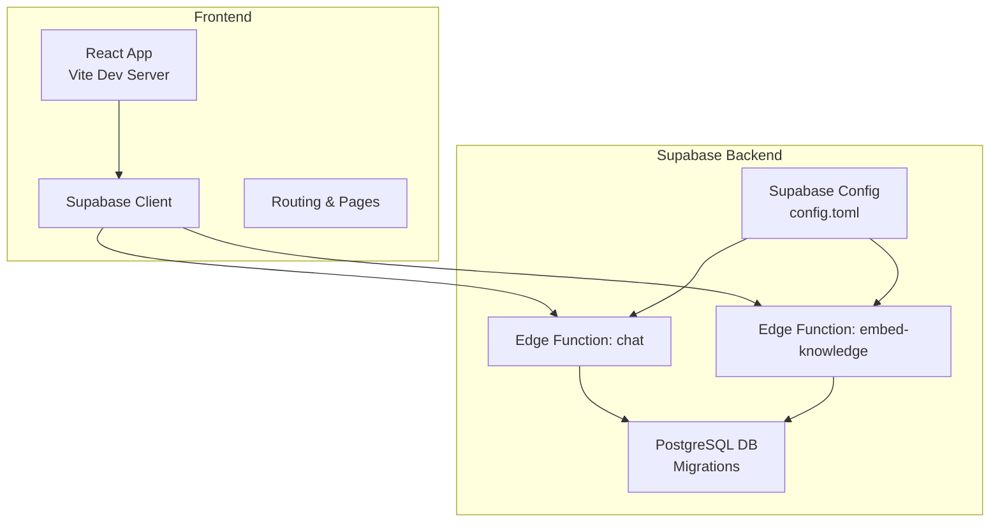

# Getting Started

<cite>
**Referenced Files in This Document**
- [README.md](file://README.md)
- [package.json](file://package.json)
- [frontend/package.json](file://frontend/package.json)
- [frontend/vite.config.ts](file://frontend/vite.config.ts)
- [frontend/src/main.tsx](file://frontend/src/main.tsx)
- [frontend/src/lib/supabase.ts](file://frontend/src/lib/supabase.ts)
- [frontend/.gitignore](file://frontend/.gitignore)
- [supabase/config.toml](file://supabase/config.toml)
- [supabase/functions/chat/index.ts](file://supabase/functions/chat/index.ts)
- [supabase/functions/_shared/types.ts](file://supabase/functions/_shared/types.ts)
- [supabase/migrations/20260408034614_initial_schema.sql](file://supabase/migrations/20260408034614_initial_schema.sql)
</cite>

## Table of Contents
1. [Introduction](#introduction)
2. [Project Structure](#project-structure)
3. [System Requirements and Prerequisites](#system-requirements-and-prerequisites)
4. [Installation and Setup](#installation-and-setup)
5. [Environment Configuration](#environment-configuration)
6. [Running the Development Server](#running-the-development-server)
7. [Supabase Backend Setup](#supabase-backend-setup)
8. [Edge Functions Deployment](#edge-functions-deployment)
9. [Verification and Testing](#verification-and-testing)
10. [Troubleshooting Guide](#troubleshooting-guide)
11. [Conclusion](#conclusion)

## Introduction
NeuralPeace AI is an expert-level neuroscience AI assistant featuring adaptive explanations, peer-reviewed citations, ethical guardrails, and an integrated 3D brain atlas. The frontend is a React 19 application built with Vite, styled with Tailwind CSS 4, and powered by Supabase for authentication, database, and edge functions. The backend leverages Supabase Edge Functions (Deno) for secure AI orchestration and PostgreSQL for knowledge storage.

## Project Structure
The repository is organized into three primary areas:
- frontend: React application with Vite, Tailwind CSS, and Supabase client integration
- supabase: Edge Functions (Deno), migrations, and configuration
- knowledge_base: Curated neuroscience content (Markdown) used for knowledge ingestion

**Diagram sources**
- [frontend/src/lib/supabase.ts:1-14](file://frontend/src/lib/supabase.ts#L1-L14)
- [supabase/functions/chat/index.ts:1-207](file://supabase/functions/chat/index.ts#L1-L207)
- [supabase/config.toml:1-404](file://supabase/config.toml#L1-L404)
- [supabase/migrations/20260408034614_initial_schema.sql:1-86](file://supabase/migrations/20260408034614_initial_schema.sql#L1-L86)

**Section sources**
- [README.md:64-77](file://README.md#L64-L77)

## System Requirements and Prerequisites
- Node.js 18 or higher
- Supabase CLI (recommended for local development)
- Perplexity API key (as referenced in the project)
- Git for cloning the repository

**Section sources**
- [README.md:23-28](file://README.md#L23-L28)

## Installation and Setup
Follow these steps to clone and prepare the project:

1. Clone the repository to your local machine.
2. Install dependencies for the frontend:
   - Navigate to the frontend directory and run the package manager install command.
3. Build the project (optional):
   - Use the build script to compile assets for production deployment.

Notes:
- The root package.json defines convenience scripts to run frontend commands via npm --prefix frontend.

**Section sources**
- [README.md:29-46](file://README.md#L29-L46)
- [package.json:5-8](file://package.json#L5-L8)

## Environment Configuration
Configure environment variables for both frontend and backend:

Frontend (.env.local in frontend):
- VITE_SUPABASE_URL: Supabase project URL
- VITE_SUPABASE_ANON_KEY: Supabase anonymous public key

Frontend (optional but recommended):
- VITE_SENTRY_DSN: Sentry DSN for error monitoring (optional)
- GEMINI_API_KEY: Gemini API key (used in Vite config for build-time injection)

Frontend runtime validation:
- The Supabase client initialization throws an error if required environment variables are missing.

Frontend build configuration:
- Vite loads environment variables and injects GEMINI_API_KEY into the app at build time.

Frontend privacy:
- The frontend .gitignore excludes .env* files except .env.example to prevent secrets from being committed.

**Section sources**
- [README.md:37-42](file://README.md#L37-L42)
- [frontend/src/lib/supabase.ts:4-11](file://frontend/src/lib/supabase.ts#L4-L11)
- [frontend/vite.config.ts:10-12](file://frontend/vite.config.ts#L10-L12)
- [frontend/src/main.tsx:7-16](file://frontend/src/main.tsx#L7-L16)
- [frontend/.gitignore:7](file://frontend/.gitignore#L7)

## Running the Development Server
Start the frontend development server:

- From the repository root, run the dev script to launch Vite on the configured port.
- The frontend uses Vite with React and Tailwind CSS, and exposes a development server with hot module replacement.

Optional: If you plan to run Supabase locally, review the Supabase configuration for ports and services.

**Section sources**
- [README.md:43-46](file://README.md#L43-L46)
- [frontend/package.json:7](file://frontend/package.json#L7)
- [supabase/config.toml:88-95](file://supabase/config.toml#L88-L95)

## Supabase Backend Setup
The backend logic is implemented as Supabase Edge Functions and managed via migrations. Key points:

- Edge Functions (Deno) handle AI orchestration, caching, safety checks, and RAG.
- Migrations define database schemas, enums, and row-level security policies.
- Supabase configuration controls ports, authentication, edge runtime, and analytics.

Supabase configuration highlights:
- Edge runtime enabled with Deno v2 and inspector port for debugging.
- Auth settings include site URL, redirect URLs, and rate limits.
- Studio and other services are configured with dedicated ports.

**Section sources**
- [README.md:48-62](file://README.md#L48-L62)
- [supabase/config.toml:364-376](file://supabase/config.toml#L364-L376)
- [supabase/config.toml:150-171](file://supabase/config.toml#L150-L171)
- [supabase/config.toml:88-95](file://supabase/config.toml#L88-L95)

## Edge Functions Deployment
Deploy the Supabase Edge Functions:

- Deploy the chat function and embed-knowledge function using the Supabase CLI.
- Set required secrets for the functions, including Gemini API key, model, and allowed origins.

Secrets and deployment commands are documented in the project README.

**Section sources**
- [README.md:52-62](file://README.md#L52-L62)

## Verification and Testing
Perform these checks to ensure proper installation:

- Frontend:
  - Confirm the development server starts without errors.
  - Verify environment variables are loaded (check for Supabase client initialization errors).
  - Test basic routing and UI rendering.

- Backend:
  - Confirm Supabase CLI is installed and authenticated.
  - Verify function deployment succeeds and secrets are set.
  - Check database migrations apply correctly.

- Integration:
  - Authenticate via Supabase Auth.
  - Send a test chat request to the deployed chat function.
  - Validate rate limiting and CORS behavior.

**Section sources**
- [frontend/src/lib/supabase.ts:7-11](file://frontend/src/lib/supabase.ts#L7-L11)
- [supabase/functions/chat/index.ts:31-54](file://supabase/functions/chat/index.ts#L31-L54)

## Troubleshooting Guide
Common setup issues and resolutions:

- Missing Supabase environment variables:
  - Symptom: Frontend throws an error indicating missing Supabase URL or anonymous key.
  - Resolution: Create .env.local in the frontend directory with VITE_SUPABASE_URL and VITE_SUPABASE_ANON_KEY.

- Supabase CLI not found:
  - Symptom: Commands fail because the Supabase CLI is not installed or not in PATH.
  - Resolution: Install the Supabase CLI and ensure it is available in your terminal.

- Function deployment failures:
  - Symptom: Deployment errors when pushing edge functions.
  - Resolution: Verify Supabase project reference, correct function names, and that secrets are set.

- Authentication errors:
  - Symptom: 401 Unauthorized when calling chat endpoint.
  - Resolution: Ensure Authorization header is present and valid, and that the user is authenticated.

- CORS issues:
  - Symptom: Browser blocks requests due to origin mismatch.
  - Resolution: Set ALLOWED_ORIGINS with your frontend domain(s) and ensure the Supabase project configuration matches.

- Rate limiting:
  - Symptom: 429 responses when sending frequent requests.
  - Resolution: Wait for the retry-after period or adjust rate limits in the backend.

- Database schema issues:
  - Symptom: Errors related to missing tables or policies.
  - Resolution: Apply migrations and verify row-level security policies are enabled.

**Section sources**
- [frontend/src/lib/supabase.ts:7-11](file://frontend/src/lib/supabase.ts#L7-L11)
- [supabase/functions/chat/index.ts:40-66](file://supabase/functions/chat/index.ts#L40-L66)
- [supabase/migrations/20260408034614_initial_schema.sql:79-86](file://supabase/migrations/20260408034614_initial_schema.sql#L79-L86)

## Conclusion
You now have the essential steps to set up NeuralPeace AI locally. Ensure all prerequisites are met, configure environment variables, deploy edge functions, and verify the integration between the frontend and Supabase backend. Use the troubleshooting guide to resolve common issues and validate your setup with the provided verification steps.